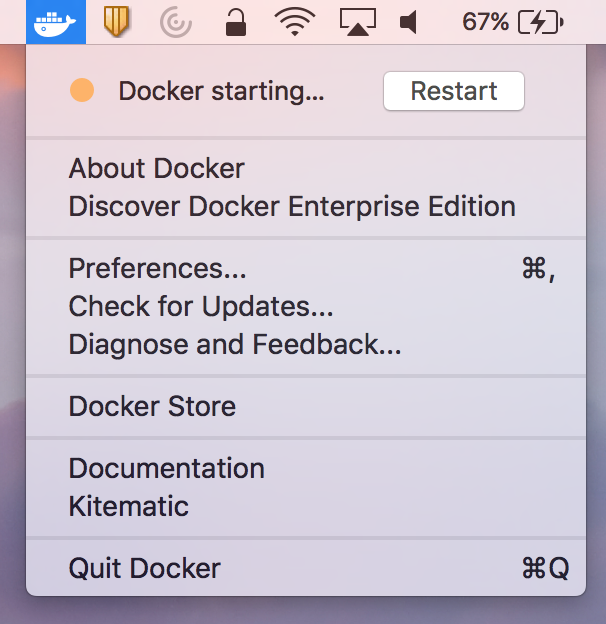

So it seems, no matter where I go, I always come back to Docker! Not that this is problematic in and of itself, as it just starts highlighting why it's necessary, or at the very least, the kind of work Docker Containers will do _for you_ instead of the usual "what version of Java does this need? What other specific environment configs does _this project_ need that I need to notate so I don't conflict with _that project_" - and yes, I'm aware some Uber developers out there do this like nothing - but it's not a skill I picked up, and Docker fills that void for me.

## What is jBPM?

jBPM is a toolkit for building business applications to help automate business processes and decisions.

jBPM originates from BPM (Business Process Management) but it has evolved to enable users to pick their own path in business automation. It provides various capabilities that simplify and externalize business logic into reusable assets such as cases, processes, decision tables and more.

## Why I cared at all about jBPM

A current task is getting [jBPM - Business Process Management](https://www.jbpm.org/learn/gettingStarted.html) up and running on different people's machines. It seems OSX always likes to be difficult with it's Java settings - too new, and things won't work, and then you need to downgrade. But I hate going backwards, so fortunately, they have a Dockerized container!

That means - I don't care what version java you're running, we can get the whole shebang up-and-running with some command-line goodness.

## Installation of the Tools

Some of this is copy/paste from the respective sites - this just condenses it into one space.

### xCode Command Line Tools:

If you do not have these installed already, Homebrew will attempt to install them for you.

If you'd like to install them yourself:

    xcode-select --install

Alternatively, they can be downloaded from: [developer.apple.com/downloads](developer.apple.com/downloads) or the iTunes Store: [Xcode](https://itunes.apple.com/us/app/xcode/id497799835)

### Homebrew
[Homebrew: https://brew.sh/](https://brew.sh/)

#### Install Homebrew:
(below copied from the Homebrew site):

    /bin/bash -c "$(curl -fsSL https://raw.githubusercontent.com/Homebrew/install/master/install.sh)"

Paste that in a macOS Terminal or Linux shell prompt.

The script explains what it will do and then pauses before it does it.

_You will probably need to close and reopen your terminal window._

    $> brew --version
    // should output:
    Homebrew 2.2.14-14-g0404ce2

(or some other more recent version)

### Docker
_[Docker Installation: https://docs.docker.com/docker-for-mac/install/](https://docs.docker.com/docker-for-mac/install/)_
_[Docker for Mac: https://docs.docker.com/docker-for-mac/](https://docs.docker.com/docker-for-mac/)_

#### Installation via CLI:
    brew cask install docker

#### Launch:
1. Press `⌘ + Space` to bring up Spotlight Search and enter Docker to launch Docker.
1. In the Docker needs privileged access dialog box, click OK.
1. Enter password and click OK.

When Docker is launched in this manner, a Docker whale icon appears in the status menu.
Example:

As soon as the whale icon appears, the symbolic links for `docker`, `docker-compose`, `docker-credential-osxkeychain` and `docker-machine` are created in `/usr/local/bin`.

    $> ls -l /usr/local/bin/docker*
    lrwxr-xr-x  1 susam  domain Users  67 Apr 12 14:14 /usr/local/bin/docker -> /Users/susam/Library/Group Containers/group.com.docker/bin/docker
    lrwxr-xr-x  1 susam  domain Users  75 Apr 12 14:14 /usr/local/bin/docker-compose -> /Users/susam/Library/Group Containers/group.com.docker/bin/docker-compose
    lrwxr-xr-x  1 susam  domain Users  90 Apr 12 14:14 /usr/local/bin/docker-credential-osxkeychain -> /Users/susam/Library/Group Containers/group.com.docker/bin/docker-credential-osxkeychain
    lrwxr-xr-x  1 susam  domain Users  75 Apr 12 14:14 /usr/local/bin/docker-machine

#### Verify Docker is Running

#### Test Docker Works

    $> docker run hello-world
    Unable to find image 'hello-world:latest' locally
    latest: Pulling from library/hello-world
    78445dd45222: Pull complete
    Digest: sha256:c5515758d4c5e1e838e9cd307f6c6a0d620b5e07e6f927b07d05f6d12a1ac8d7
    Status: Downloaded newer image for hello-world:latest
    Hello from Docker!
    This message shows that your installation appears to be working correctly.
    To generate this message, Docker took the following steps:
    1. The Docker client contacted the Docker daemon.
    2. The Docker daemon pulled the "hello-world" image from the Docker Hub.
    3. The Docker daemon created a new container from that image which runs the
        executable that produces the output you are currently reading.
    4. The Docker daemon streamed that output to the Docker client, which sent it
        to your terminal.
    To try something more ambitious, you can run an Ubuntu container with:
    $ docker run -it ubuntu bash
    Share images, automate workflows, and more with a free Docker ID:
    https://cloud.docker.com/
    For more examples and ideas, visit:
    https://docs.docker.com/engine/userguide/

Followed by:

_of course, your versions may differ_

    $> docker version
    Client:
    Version:      17.03.1-ce
    API version:  1.27
    Go version:   go1.7.5
    Git commit:   c6d412e
    Built:        Tue Mar 28 00:40:02 2017
    OS/Arch:      darwin/amd64
    Server:
    Version:      17.03.1-ce
    API version:  1.27 (minimum version 1.12)
    Go version:   go1.7.5
    Git commit:   c6d412e
    Built:        Fri Mar 24 00:00:50 2017
    OS/Arch:      linux/amd64
    Experimental: true

##### EXTRA - NOT REQUIRED - PURELY INFORMATIONAL

_If you are going to use docker-machine to create virtual machines, install VirtualBox._

    $> brew cask install virtualbox

_Note that if VirtualBox is not installed, then docker-machine fails with the following error._

    $> docker-machine create manager
    Running pre-create checks...
    Error with pre-create check: "VBoxManage not found. Make sure VirtualBox is installed and VBoxManage is in the path"

### jBPM

_[jBPM: https://www.jbpm.org/learn/gettingStarted.html (USING DOCKER tab)](https://www.jbpm.org/learn/gettingStarted.html)_

_(below copied from the jBPM site):_

#### Running jBPM Docker image

    $> docker run -p 8080:8080 -p 8001:8001 -d --name jbpm-server-full jboss/jbpm-server-full:latest

Once container and web applications started, you can navigate to it and login using the username wbadmin and password wbadmin or any of the users available in the Business Central listed in the section below.

http://localhost:8080/business-central

**Username:** wbadmin

**Password:** wbadmin

That’s all that is needed to get fully configured and running jBPM distribution that includes:
- WildFly server
- Business Central
- KIE Server
- jBPM Case Management showcase
- jBPM Service repository

Everything configured to work together smoothly and you can access them at following locations:
- Business Central - http://localhost:8080/business-central
- KIE Server - http://localhost:8080/kie-server/services/rest/server
- KIE Server Swagger docs - http://localhost:8080/kie-server/docs
- jBPM case management - http://localhost:8080/jbpm-casemgmt

